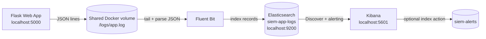

# Minimal SIEM Pipeline with Brute-force Login Detection

This project is a small Docker-based SIEM lab. A demo Flask application writes structured JSON login logs, Fluent Bit tails the log file, Elasticsearch stores events in `siem-app-logs`, and Kibana is used for investigation and alerting.

The main detection use case is brute-force-like behavior: more than 5 failed login attempts within 1 minute.

## Architecture



## Prerequisites

- Docker
- Docker Compose v2
- At least 4 GB of free memory for the local stack
- Ports `5000`, `5601`, and `9200` available on localhost

## Run the Stack

```bash
docker compose up -d --build
```

The first startup can take a few minutes while Elasticsearch and Kibana initialize.

## Check Services

Check the Flask app:

```bash
curl http://localhost:5000
```

Check Elasticsearch:

```bash
curl http://localhost:9200
```

Open Kibana:

```bash
open http://localhost:5601
```

If `open` is not available on your OS, browse to `http://localhost:5601` manually.

## Trigger Failed Logins

```bash
./demo/trigger_failed_logins.sh
```

The script sends 6 failed login POST requests to `http://localhost:5000/login` with username `admin` and password `wrong`.

## Verify Logs in Elasticsearch

You can check indexed failed login events directly:

```bash
curl "http://localhost:9200/siem-app-logs/_search?pretty" \
  -H "Content-Type: application/json" \
  -d '{"query":{"bool":{"filter":[{"term":{"event_type":"login_attempt"}},{"term":{"status":"failed"}}]}}}'
```

## Verify Logs in Kibana

1. Open Kibana at `http://localhost:5601`.
2. Go to **Stack Management -> Data Views**.
3. Create a data view named `siem-app-logs`.
4. Use `siem-app-logs` as the index pattern.
5. Select `@timestamp` as the time field.
6. Open **Discover**.
7. Select the `siem-app-logs` data view.
8. Filter with KQL:

```text
status: "failed"
```

You should see the failed login attempts generated by the demo script.

## Configure the Alert Rule

Use Kibana alerting to create an index threshold rule:

1. Open **Stack Management -> Rules**.
2. Create a rule.
3. Choose **Index threshold**.
4. Indices: `siem-app-logs`.
5. Time field: `@timestamp`.
6. Query filter:

```text
event_type: "login_attempt" and status: "failed"
```

7. Condition: count is above `5`.
8. Time window: `1 minute`.
9. Check interval: `1 minute` or shorter for the demo.
10. Save and enable the rule.

After running `./demo/trigger_failed_logins.sh`, the rule should fire and be visible in Kibana under the rule details and alert status views.

## Optional Alert Event Index

To write alert events into Elasticsearch:

1. Open **Stack Management -> Connectors**.
2. Create an **Index** connector.
3. Set the destination index to `siem-alerts` or `kibana-alerts`.
4. Add the connector as an action on the failed-login rule.
5. Use an action body similar to:

```json
{
  "timestamp": "{{date}}",
  "event_type": "siem_alert",
  "rule_name": "{{rule.name}}",
  "reason": "{{context.reason}}",
  "source_index": "siem-app-logs",
  "severity": "high"
}
```

Create a Kibana data view for `siem-alerts` to inspect generated alert documents.

## Flask App Credentials

Valid demo credentials:

```text
username: admin
password: password123
```

Every success and failure is logged as one JSON line.

## Known Limitations

- Elastic security is disabled for local lab simplicity.
- The deployment is local-only and not hardened for production.
- Detection is a simple threshold rule, not behavior analytics.
- The pipeline does not collect host, Docker daemon, or operating system auth logs.
- There is no default external notification channel such as Slack or email.

## Future Improvements

- Enable Elastic security and TLS.
- Add Slack, email, or webhook alert actions.
- Collect Docker, system, and authentication logs.
- Build Kibana dashboards for login trends and source IPs.
- Add more detection rules.
- Add an incident response workflow for triage and documentation.
