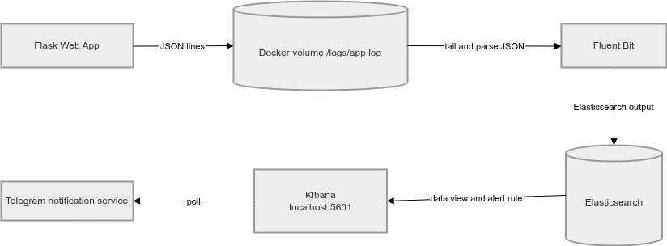
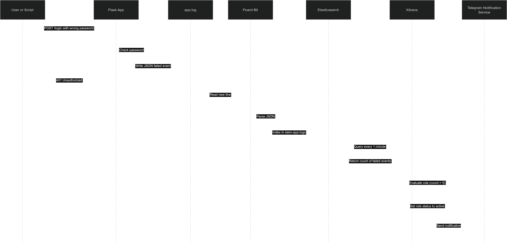

# SIEM Pipeline for Detection of Repeated Failed Login Attempts

> Askar Dinikeev\
> Egor Pustovoytenko\
> Marsel Fayzullin\
> Vladislav Kuznetsov

## Abstract

This project implements a SIEM pipeline using Docker, Flask, Fluent Bit, Elasticsearch, and Kibana. The Flask application writes JSON logs of login attempts. Fluent Bit reads and parses these logs. Elasticsearch stores them in the index `siem-app-logs`. Kibana provides log search and an alert rule on repeated failed login attempts. The rule triggers when the count of failed login events exceeds 5 in 1 minute. A separate service polls the Kibana rule status and sends a Telegram message when the rule becomes active. The pipeline runs in Docker Compose on one host.

## Introduction

Systems produce many events that are relevant for security, but the logs of these events are difficult to use when they are stored in separate locations. Security monitoring requires that events are collected and stored in one place, with rules for detecting incidents and sending alerts.

Many failed login attempts in a short interval of time is one example of a detectable event. This project demonstrates a SIEM workflow that sends an alert via Telegram when the count of failed login attempts exceeds a threshold in a fixed time window.

The objectives of the project are: create a login application, set up a log collector, set up log storage, set up an alert rule, and set up a notification service.

## Methods

### Architecture

The pipeline consists of five services connected through a single Docker network. The data flow is shown in the diagram below.



The sequence of events from a login attempt to an alert is shown in the diagram below.



### Components

The Flask application has two endpoints. `GET /` returns a login form. `POST /login` accepts the parameters `username` and `password`, checks hardcoded credentials, returns success or failure, and writes one log line. Every login attempt is written as one JSON line to `/logs/app.log`. The Flask application and Fluent Bit share this file through a Docker volume. Fluent Bit tails `/logs/app.log`, parses JSON with `fluent-bit/parsers.conf`, keeps the `timestamp` field from the application, adds `@timestamp`, and sends the records to Elasticsearch. Kibana connects to Elasticsearch. It is used for Discover, data views, alert rules, and alert status. The script `demo/setup_kibana.sh` creates the data view `siem-app-logs` and the rule `Failed login burst` through the Kibana API. The `siem-tg-notif` service runs as a container. It polls the Kibana rule status and sends a Telegram message if the rule `Failed login burst` is active. The service receives the Kibana URL from an environment variable and the Telegram credentials from an `.env` file that is in gitignore.

### Log Schema

A failed login event has the structure.

```json
{
  "timestamp": "2026-04-26T12:00:00Z",
  "event_type": "login_attempt",
  "username": "admin",
  "status": "failed",
  "client_ip": "127.0.0.1",
  "path": "/login",
  "method": "POST",
  "user_agent": "curl/8.0",
  "message": "Failed login attempt"
}
```

An attempt that succeeds uses `"status": "success"` and `"message": "Successful login"`.

### Deployment

The lab is deployed with Docker Compose. It starts five services: `app`, `fluent-bit`, `elasticsearch`, `kibana`, and `siem-tg-notif`.

The deployment command is:

```bash
docker compose up -d --build
```

### Detection Rule

The Kibana rule is an index threshold rule with the name: `Failed login burst` It checks documents in: `siem-app-logs`. The KQL filter is: `event_type: "login_attempt" and status: "failed"`. The condition is: `count > 5 over 1 minute`.

### Demo Traffic

The script `demo/trigger_failed_logins.sh` sends six failed login requests:

```bash
bash ./demo/trigger_failed_logins.sh
```

Each request creates one failed login event in the log file.

### Notification Design

Telegram is used for sending notification since it is easy to set up. The `siem-tg-notif` container polls the Kibana rule status API and sends a Telegram message when the rule becomes active. To enable Telegram notifications, Telegram bot api key and telegram user chat id are set using `.env` file that is read by the `siem-tg-notif` service at startup.

## Results

### Logs in Elasticsearch and Kibana

After multiple failed login attempts, the Flask application wrote JSON lines into `/logs/app.log`. Fluent Bit parsed these lines and forwarded them to Elasticsearch. A query on `siem-app-logs` returned the login events with the fields `@timestamp`, `event_type`, `status`, `client_ip`, `user_agent`, and `message`.

### Alert Rule Configuration

The rule `Failed login burst` was created during startup in Kibana with the parameters below.

```json
{
  "name": "Failed login burst",
  "tags": ["siem", "bruteforce-demo"],
  "rule_type_id": ".index-threshold",
  "consumer": "stackAlerts",
  "schedule": {"interval": "1m"},
  "params": {
      "index": ["siem-app-logs"],
      "timeField": "@timestamp",
      "aggType": "count",
      "groupBy": "all",
      "thresholdComparator": ">",
      "threshold": [5],
      "timeWindowSize": 1,
      "timeWindowUnit": "m",
      "filterKuery": "event_type: \"login_attempt\" and status: \"failed\"",
  },
  "actions": [],
  "notify_when": "onActionGroupChange",
}
```

### Alert Triggered

After six failed logins were sent in a minute, Kibana checked the rule and sent an alert. Kibana also wrote an alert into rule alerts. The `siem-tg-notif` container asks Kibana for alers, and if there are, sends a Telegram message.

## Discussion

This project demonstrates the SIEM workflow: event generation, log collection, parsing, indexing, search, and alerting. The implementation matches a production SIEM in terms of application events are collected into one index and checked by a rule.

The limitations of the project are that the detection uses one threshold rule.

Future work can include collecting Docker logs and adding rules and alerts on them.
