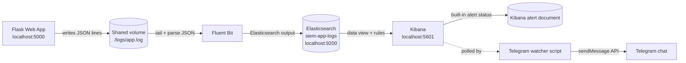

# Architecture Diagram

The demo uses a shared Docker volume for the application log file. Fluent Bit tails that file, parses each JSON line, and sends the resulting events to Elasticsearch. Kibana evaluates the failed-login threshold rule. The optional Telegram watcher reads the Kibana rule status and sends a Telegram message when the rule becomes active.
