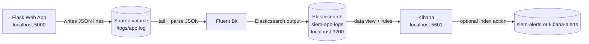

# Architecture Diagram

```mermaid
flowchart LR
    A[Flask Web App<br/>localhost:5000] -->|writes JSON lines| L[(Shared volume<br/>/logs/app.log)]
    L -->|tail + parse JSON| F[Fluent Bit]
    F -->|Elasticsearch output| E[(Elasticsearch<br/>siem-app-logs<br/>localhost:9200)]
    E -->|data view + rules| K[Kibana<br/>localhost:5601]
    K -->|optional index action| X[(siem-alerts or kibana-alerts)]
```

The demo uses a shared Docker volume for the application log file. Fluent Bit tails that file, parses each JSON line, and sends the resulting events to Elasticsearch.
