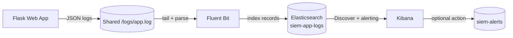

# Minimal SIEM Pipeline for Detecting Repeated Failed Login Attempts

## Abstract

This project implements a Docker-based SIEM pipeline using Flask, Fluent Bit, Elasticsearch, and Kibana. The Flask application writes structured JSON login-attempt logs, Fluent Bit collects and forwards those logs, Elasticsearch stores them in `siem-app-logs`, and Kibana provides search, visualization, and alerting for repeated failed login attempts.

## 1. Introduction

Secure systems need observability. Applications, servers, and infrastructure continuously produce logs, but raw log files alone are difficult to search, correlate, and monitor in real time. Centralized logging improves visibility by collecting events in one place and making suspicious behavior easier to detect.

The goal of this project is to build a minimal SIEM-style pipeline that collects structured application logs and detects brute-force-like login behavior. The detection use case is intentionally simple: trigger an alert when there are more than 5 failed login attempts within 1 minute.

## 2. Methods

### Architecture



### Components

The Flask web application exposes a login form and a `/login` endpoint. Every login attempt is written as a single JSON line to `/logs/app.log`.

Fluent Bit tails `/logs/app.log`, parses each line as JSON, preserves the event timestamp, and forwards records to Elasticsearch.

Elasticsearch runs in single-node mode for the local lab and stores application events in the `siem-app-logs` index.

Kibana connects to Elasticsearch, provides a data view for searching logs in Discover, and manages the failed-login alert rule.

### Log Schema

Each login attempt contains:

```json
{
  "timestamp": "2026-04-26T12:00:00Z",
  "event_type": "login_attempt",
  "username": "admin",
  "status": "failed",
  "client_ip": "127.0.0.1",
  "path": "/login",
  "method": "POST",
  "user_agent": "curl/8.0",
  "message": "Failed login attempt"
}
```

Successful attempts use `"status": "success"` and the message `"Successful login"`.

### Deployment

The system is deployed with Docker Compose. The compose file starts four services: `app`, `fluent-bit`, `elasticsearch`, and `kibana`. A shared Docker volume stores `/logs/app.log` so the app can write logs and Fluent Bit can tail them.

### Detection Rule

The detection rule checks the `siem-app-logs` index for documents where:

```text
event_type: "login_attempt" and status: "failed"
```

The alert condition is:

```text
count > 5 over the last 1 minute
```

This threshold detects a short burst of failed logins that resembles brute-force behavior.

## 3. Results

### Services Running


Running `docker compose up -d --build` starts the Flask app, Fluent Bit, Elasticsearch, and Kibana. The Flask app is reachable on `http://localhost:5000`, Elasticsearch on `http://localhost:9200`, and Kibana on `http://localhost:5601`.

### Logs Visible in Kibana


After executing `./demo/trigger_failed_logins.sh`, the Flask app writes six failed login attempts to `/logs/app.log`. Fluent Bit reads those JSON lines and indexes them into `siem-app-logs`. The events are visible in Kibana Discover after creating a data view for `siem-app-logs`.

### Alert Rule Configured


The Kibana rule uses the `siem-app-logs` index, filters for failed login attempts, and triggers when the count is above 5 in a 1-minute window.

### Alert Triggered


When the demo script generates six failed logins within the window, the alert fires. The firing alert is visible in Kibana rule details. If an Elasticsearch index connector is configured, an alert event can also be written to `siem-alerts`.

## 4. Discussion

This lab demonstrates the core SIEM workflow: structured log generation, centralized collection, indexing, investigation, and alerting. The pipeline is intentionally minimal so the detection flow is easy to understand and reproduce.

Limitations include local-only deployment, disabled Elastic security for lab simplicity, a simple threshold-based rule, no correlation across multiple services, and no real external notification channel.

Future improvements include enabling Elastic security, adding Slack or email notifications, collecting Docker, system, and authentication logs, building richer Kibana dashboards, adding more detection rules, and defining an incident response workflow for alerts.
