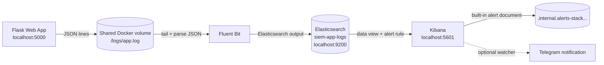

# Minimal SIEM Pipeline for Detecting Repeated Failed Login Attempts

## Abstract

This project implements a local Docker-based SIEM pipeline using Flask, Fluent Bit, Elasticsearch, and Kibana. The Flask application produces structured JSON login-attempt logs, Fluent Bit collects and parses those logs, Elasticsearch stores them in the `siem-app-logs` index, and Kibana provides log investigation plus alerting for repeated failed login attempts. The main detection rule triggers when more than 5 failed login events occur within 1 minute.

## 1. Introduction

Modern systems produce many security-relevant events, but raw logs are difficult to use when they remain scattered across application files, containers, and hosts. Security monitoring requires observability: events must be collected, normalized, stored, searched, and evaluated against detection logic.

Failed login attempts are a common signal for brute-force or password-spraying behavior. A single failed login is usually not enough to indicate an incident, but a burst of failures in a short time window can be suspicious. This project demonstrates a minimal SIEM-style workflow for that use case.

The goal is to build a small but complete local lab that shows:

- An application generating structured security events.
- A log collector forwarding those events.
- A searchable central log store.
- A Kibana alert rule that detects repeated failed logins.
- A visible alert result in Kibana.

## 2. Methods

### Architecture



### Components

The Flask web application exposes two endpoints:

- `GET /` returns a simple login form.
- `POST /login` accepts `username` and `password`, checks hardcoded demo credentials, returns success or failure, and logs every attempt.

The valid demo credentials are:

```text
username: admin
password: password123
```

Every login attempt is written as one JSON line to `/logs/app.log`. The app and Fluent Bit share this path through a Docker volume.

Fluent Bit tails `/logs/app.log`, parses JSON with `fluent-bit/parsers.conf`, preserves the original `timestamp` field, adds `@timestamp`, and sends records to Elasticsearch. The output index is:

```text
siem-app-logs
```

Elasticsearch runs in single-node mode with local-lab security disabled and a 1 GB heap:

```text
discovery.type=single-node
xpack.security.enabled=false
ES_JAVA_OPTS=-Xms1g -Xmx1g
```

Kibana connects to Elasticsearch and is used for Discover, data views, alert rules, and alert status. The helper script `demo/setup_kibana.sh` configures the `siem-app-logs` data view and creates the `Failed login burst` rule through the Kibana API.

### Log Schema

Each failed login event has this structure:

```json
{
  "timestamp": "2026-04-26T12:00:00Z",
  "event_type": "login_attempt",
  "username": "admin",
  "status": "failed",
  "client_ip": "127.0.0.1",
  "path": "/login",
  "method": "POST",
  "user_agent": "curl/8.0",
  "message": "Failed login attempt"
}
```

Successful attempts use `"status": "success"` and `"message": "Successful login"`.

### Deployment

The lab is deployed with Docker Compose. It starts four services:

- `app`
- `fluent-bit`
- `elasticsearch`
- `kibana`

The main command is:

```bash
docker compose up -d --build
```

After the containers start, Kibana objects can be configured with:

```bash
./demo/setup_kibana.sh
```

The script creates the data view and the alert rule. This avoids manual clicking during the normal demo flow.

### Detection Rule

The Kibana rule is an index-threshold rule named:

```text
Failed login burst
```

It checks documents in:

```text
siem-app-logs
```

The KQL filter is:

```text
event_type: "login_attempt" and status: "failed"
```

The alert condition is:

```text
count > 5 over 1 minute
```

This rule detects a short burst of failed logins that resembles brute-force behavior.

### Demo Traffic

The demo script sends six failed login requests:

```bash
./demo/trigger_failed_logins.sh
```

Each request posts:

```text
username=admin
password=wrong
```

The expected HTTP response is `401`, and each request produces a failed-login JSON event.

### Notification Design

Kibana alerting can show alert state in the UI without an external connector. In the tested local stack, alert documents are also written by Kibana into an internal alert index similar to:

```text
.internal.alerts-stack.alerts-default-000001
```

For external notifications, Telegram is used because it is simple to test in a local demo and only needs a bot token plus a chat ID.

Kibana 8.13.4 exposes a webhook connector type, but it requires a Gold license. The local lab runs on the free Basic license, where the webhook connector is disabled. To keep the demo reproducible without changing the license, Telegram support is implemented with `demo/watch_telegram_alerts.sh`. The watcher polls the Kibana rule status and sends a Telegram message when the `Failed login burst` rule becomes active.

To enable Telegram notifications, the deployment needs:

- Telegram bot token from BotFather.
- Telegram chat ID for the target user, group, or channel.
- Confirmation that the bot has permission to send messages there.

The watcher is started with:

```bash
./demo/watch_telegram_alerts.sh
```

These values should be passed through environment variables or local `.env` files, not committed to git.

## 3. Results

### Services Running

docs/screenshots/01-compose-running.png

`docker compose up -d --build` starts the full stack. The service URLs are:

- Flask app: `http://localhost:5000`
- Elasticsearch: `http://localhost:9200`
- Kibana: `http://localhost:5601`

The stack was verified with `docker compose ps`, HTTP checks against Flask and Elasticsearch, and Kibana status checks.

### Logs Visible in Elasticsearch and Kibana


After running the failed-login script, the Flask app writes JSON lines to `/logs/app.log`. Fluent Bit parses and forwards them to Elasticsearch. Querying `siem-app-logs` shows the indexed login events with `@timestamp`, `event_type`, `status`, `client_ip`, `user_agent`, and message fields.

Example Elasticsearch count check:

```bash
curl "http://localhost:9200/siem-app-logs/_count?pretty"
```

During verification, the index contained multiple failed login events, and the latest six-event burst was indexed as separate documents.

### Alert Rule Configured


The `Failed login burst` rule was created in Kibana with:

- Index: `siem-app-logs`
- Time field: `@timestamp`
- Filter: `event_type: "login_attempt" and status: "failed"`
- Threshold: count greater than `5`
- Time window: `1 minute`
- Schedule interval: `1 minute`

### Alert Triggered


After generating six failed logins within the rule window, Kibana evaluated the rule and reported an active alert. The verified rule status included:

```text
last_run.alerts_count.active: 1
last_run.alerts_count.new: 1
execution_status.status: active
```

Kibana also created an internal stack alert document for the rule. This satisfies the requirement that the alert result is visible in Kibana UI. With `TELEGRAM_BOT_TOKEN` and `TELEGRAM_CHAT_ID` configured, `demo/watch_telegram_alerts.sh` sends a Telegram notification when the rule becomes active.

## 4. Discussion

This project demonstrates the essential SIEM flow: event generation, collection, parsing, indexing, investigation, and alerting. The implementation is intentionally minimal, but the core behavior is realistic: application security events are centralized and evaluated by a threshold-based detection rule.

One implementation detail was important for correctness. Fluent Bit initially used generated document IDs, which caused identical same-second events to overwrite each other in Elasticsearch. Removing generated IDs allowed Elasticsearch to assign unique document IDs, preserving all failed-login events in a burst.

Current limitations:

- The deployment is local-only.
- Elastic security is disabled for lab simplicity.
- The detection is a simple threshold rule.
- There is no correlation across multiple applications or hosts.
- Only application login logs are collected.
- Telegram notification requires a bot token and chat ID in the local environment.

Future improvements:

- Enable Elastic security and TLS.
- Replace the watcher with a native Kibana webhook connector if a Gold or trial license is available.
- Collect Docker, system, and authentication logs.
- Add dashboards for failed-login trends, source IPs, and usernames.
- Add more detection rules for suspicious paths, unusual user agents, and repeated attempts from one IP.
- Add an incident response workflow for alert triage and documentation.
